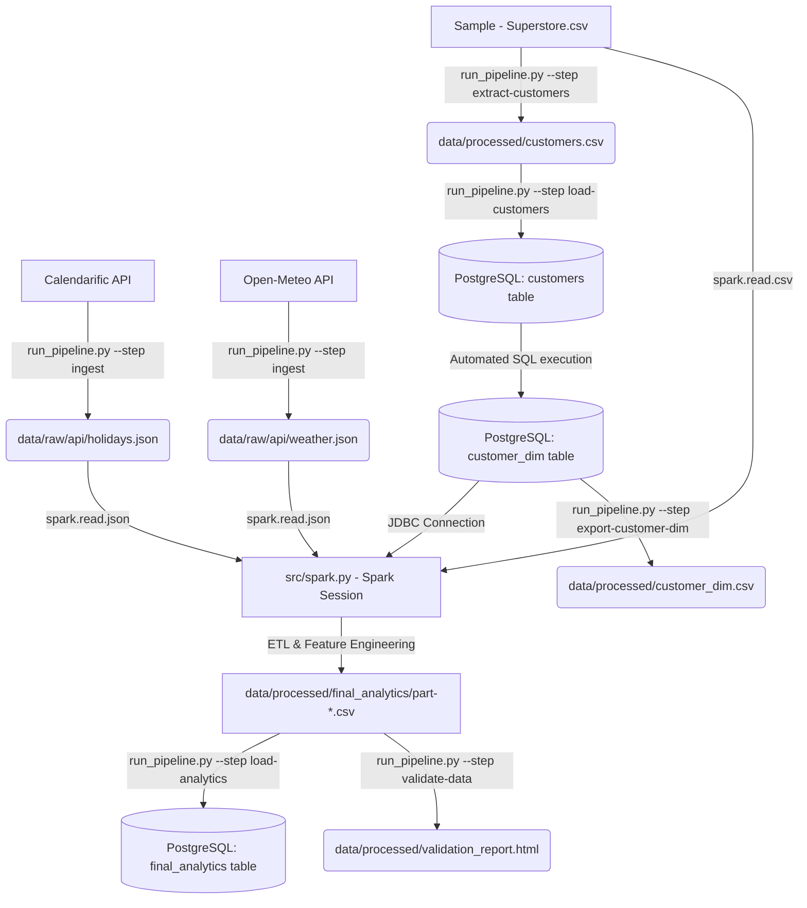

# 🛍️ Retail Holiday Sales Analytics Pipeline

[](#-data-quality--validation-suite)
[](#-spark-etl--feature-engineering)
[](#-database-schema--ddl)
[](#-running-the-test-suite)

An end-to-end, production-grade data engineering pipeline designed to analyze how US holidays and regional weather affect retail sales performance. The pipeline ingests raw transaction sales data, fetches US holiday metadata via the Calendarific REST API, integrates historical weather conditions using the Open-Meteo API, synchronizes database schemas, and processes it all using Apache PySpark to generate feature-engineered datasets for analytics and machine learning.

---

## 🗺️ Architecture & Data Flow

The pipeline automatically merges and processes four main sources of data:
1. **Staging Sales Ledger (`Sample - Superstore.csv`)**: CSV record of orders, profit, customer details, and transaction dates.
2. **Calendarific API (REST)**: Dynamic calendar metadata used to identify US holidays (e.g. Valentine's Day, Memorial Day, Christmas).
3. **Open-Meteo API (REST)**: Historic daily weather metrics (temp, snow, precipitation) matching customer regions.
4. **PostgreSQL Database**: Relational database warehouse storing unique customer dimensions and the final consolidated tables.

### Data Flow Diagram



---

## 🛠️ Step 1: Install System Prerequisites (Foolproof Windows Guide)

If you are on Windows, follow these click-by-click instructions. If you miss these, PySpark will crash.

### 1. Install Java (JDK 8 or 11)
Apache Spark runs on Java. You need Java Development Kit 8 or 11.
1. Download **JDK 11** (e.g., from [Eclipse Temurin/Adoptium](https://adoptium.net/)) and install it.
2. Remember where it was installed (usually `C:\Program Files\Eclipse Foundation\jdk-11.x.x` or `C:\Program Files\Java\jdk1.8.x`).
3. Set your system environment variable:
   * Press your Windows Keyboard key, search for **"Edit the system environment variables"**, and open it.
   * Click the **Environment Variables...** button at the bottom.
   * Under the **System Variables** block, click **New...**.
   * Variable Name: `JAVA_HOME`
   * Variable Value: Paste your JDK installation directory path here (e.g., `C:\Program Files\Eclipse Foundation\jdk-11.0.22`).
   * Click **OK**.

### 2. Configure Apache Hadoop Winutils
Apache Spark requires Hadoop native binaries on Windows to write files to your local hard drive.
1. Create a folder named `hadoop` directly on your C drive: `C:\hadoop`.
2. Inside `C:\hadoop`, create a folder named `bin` (so you have `C:\hadoop\bin`).
3. Download **Hadoop 3.0.0** binaries (`winutils.exe` and `hadoop.dll`) from a trusted source (such as the [cdarlint/winutils GitHub Repository](https://github.com/cdarlint/winutils/tree/master/hadoop-3.0.0/bin)).
4. Move/copy both `winutils.exe` and `hadoop.dll` into your newly created `C:\hadoop\bin` folder.
5. Add the variables to Windows:
   * Open the **Environment Variables** panel again.
   * Under **System Variables**, click **New...**.
   * Variable Name: `HADOOP_HOME`
   * Variable Value: `C:\hadoop`
   * Click **OK**.
   * Next, in **System Variables**, find the variable named `Path`, select it, and click **Edit...**.
   * Click **New** on the right side.
   * Type in: `%HADOOP_HOME%\bin`
   * Click **New** again, and type in: `%JAVA_HOME%\bin`
   * Click **OK** to close all panels.

### 3. Install & Start PostgreSQL
1. Download and install PostgreSQL (v12 or newer) from the [PostgreSQL Official Website](https://www.postgresql.org/download/windows/).
2. Keep the default username as `postgres` and remember the password you set during installation.
3. Once installed, open **pgAdmin 4** (the visual interface installed with PostgreSQL):
   * Right-click on **Servers** -> **Register** -> **Server...** (or connect to your local server by clicking on it and entering your password).
   * Right-click on **Databases** -> **Create** -> **Database...**.
   * Database name: `retail_dw`
   * Click **Save**.

---

## ⚙️ Step 2: Project setup

1. Open your terminal (e.g., PowerShell on Windows) inside this project folder:
   ```powershell
   cd holiday_analytics_pipeline
   ```
2. **Create a Virtual Environment**:
   ```bash
   python -m venv venv
   ```
3. **Activate the Virtual Environment**:
   * **PowerShell**:
     ```powershell
     .\venv\Scripts\Activate.ps1
     ```
   * **Windows CMD Prompt**:
     ```cmd
     .\venv\Scripts\activate.bat
     ```
   * **Linux/macOS terminal**:
     ```bash
     source venv/bin/activate
     ```
4. **Install Required Libraries**:
   ```bash
   pip install -r requirements.txt
   ```

---

## 🔑 Step 3: Get your API Key & Configuration

1. Go to [Calendarific API](https://calendarific.com/) and register for a free account.
2. Log in and copy your **API Key** from the developer dashboard.
3. In the root directory of this project, create a text file named exactly `.env`.
4. Copy and paste the lines below into it, substituting your actual PostgreSQL password and Calendarific API Key:

```ini
DB_HOST=localhost
DB_PORT=5432
DB_NAME=retail_dw
DB_USER=postgres
DB_PASSWORD=your_postgres_password_here

CALENDARIFIC_API_KEY=your_calendarific_api_key_here
```

---

## 🚀 Step 4: Run the Pipeline (Step-by-Step)

The entire pipeline is run using the master script `run_pipeline.py`. When you run steps, the code handles database schema creation, staging, and integrations automatically!

### Option A: Run Everything Automatically in One Command
This command runs all steps sequentially from raw APIs to database loading and data quality validation:
```bash
python run_pipeline.py --step all
```

---

### Option B: Run Steps Manually (One by One)

If you prefer to run steps individually to monitor each stage:

#### 1. Ingest Holiday and Weather APIs
Downloads API results and writes JSON files to `data/raw/api/`:
```bash
python run_pipeline.py --step ingest
```

#### 2. Extract Customers
Pulls unique customer details out of the large retail CSV file:
```bash
python run_pipeline.py --step extract-customers
```

#### 3. Load Customers (Automatically Sets Up PostgreSQL Tables)
Writes extracted customers into PostgreSQL. 
* **Note**: Under the hood, this step automatically reads [sql/create_tables.sql](file:///c:/Users/mishr/holiday_analytics_pipeline/sql/create_tables.sql) to build the database schema and [sql/insert_customers.sql](file:///c:/Users/mishr/holiday_analytics_pipeline/sql/insert_customers.sql) to upsert entries into the `customer_dim` table. **No manual SQL copying is needed.**
```bash
python run_pipeline.py --step load-customers
```

#### 4. Run PySpark Feature Engineering
Starts the PySpark processing engine to clean the transactional logs, fetch variables from the database over JDBC, parse API JSON logs, join tables, and write analytical features to your disk:
```bash
python run_pipeline.py --step spark-etl
```

#### 5. Load Final Analytical Features into PostgreSQL
Reads PySpark part CSV outputs and uploads the final dataset to the `final_analytics` table in the database:
```bash
python run_pipeline.py --step load-analytics
```

#### 6. Validate Data & View HTML Report
Performs quality audits against all files and databases:
```bash
python run_pipeline.py --step validate-data
```
* **To View Report**: Navigate to the project directory, go to `data/processed/`, and double-click [validation_report.html](file:///c:/Users/mishr/holiday_analytics_pipeline/data/processed/validation_report.html) to open it in Chrome, Edge, or Firefox.

---

## 🔍 Data Quality Expectations & Rules

The custom verification script (`src/validation.py`) enforces strict assertions inspired by Great Expectations:
* **Staging Sales**: Columns structure, non-null transactions, sales boundary checks ($\ge 0$), and order quantities ($\ge 1$).
* **Holidays API JSON**: Verifies dates are correct format and bounds lie between 2014 and 2017.
* **Weather API JSON**: Assures coordinates map to valid Central/East/South/West regions and temperatures are within boundaries ($-50^\circ\text{C}$ to $50^\circ\text{C}$).
* **Feature Store Output**: Confirms engineered columns (rolling average sales, seasonal markers, extreme weather flags) are correct types and contain no unexpected nulls.

---

## 🧪 Running the Test Suite

We write unit tests to ensure that parsing and transformations execute flawlessly. To run the tests without encountering search path failures, execute:

```bash
python -m pytest tests/
```

* **[tests/test_api.py](file:///c:/Users/mishr/holiday_analytics_pipeline/tests/test_api.py)**: Audits holiday response parser and holiday filter arrays.
* **[tests/test_weather_api.py](file:///c:/Users/mishr/holiday_analytics_pipeline/tests/test_weather_api.py)**: Audits weather coordinates mapper and response format parsing.
* **[tests/test_validation.py](file:///c:/Users/mishr/holiday_analytics_pipeline/tests/test_validation.py)**: Validates assertion checkers in the quality suite.
* **[tests/test_pyspark.py](file:///c:/Users/mishr/holiday_analytics_pipeline/tests/test_pyspark.py)**: Audits Spark window functions, column cast operations, and join logic.

---

## 📊 Feature Store Glossary

These columns are produced by the Spark ETL pipeline (`src/spark.py`) for downstream ML models and visual dashboards:

| Column Name | Type | Description | Purpose |
| :--- | :--- | :--- | :--- |
| `holiday_name` | String | Name of the holiday (e.g. Valentine's Day) | Details specific holiday |
| `holiday_flag` | Integer | `1` on a holiday, `0` otherwise | Identifies direct holiday orders |
| `month` / `year` / `quarter` | Integer | Time dimension keys | Temporal analysis grouping |
| `weekend_flag` | Integer | `1` if ordered on Sat/Sun, `0` otherwise | Segment shopping patterns |
| `profit_margin` | Double | `(Profit / Sales) * 100` rounded to 2 decimals | Order profit margin ratio |
| `temp_c` | Double | Average region temperature in Celsius | Climatic demand impacts |
| `precipitation_mm` | Double | Daily precipitation sum in mm | Rainy weather impact |
| `snowfall_cm` | Double | Daily snowfall sum in cm | Winter weather disruption |
| `wind_speed_kmh` | Double | Max daily wind speed in km/h | Severe wind velocity |
| `is_raining` / `is_snowing` | Integer | `1` if precip/snowfall > 0, `0` otherwise | Boolean indicator variables |
| `extreme_weather_flag` | Integer | `1` if precip > 25mm OR snow > 5cm OR wind > 40kmh | Highlights severe disruptions |
| `days_until_next_holiday` | Integer | Count of days leading to next US holiday | Captures pre-holiday shopping rush |
| `days_since_last_holiday` | Integer | Count of days elapsed since previous US holiday | Captures post-holiday patterns |
| `holiday_shopping_season_flag` | Integer | `1` between Black Friday and Christmas, `0` otherwise | Highlights peak US retail period |
| `rolling_sales_7d` | Double | 7-day rolling window sum of region sales | Captures region short-term demand |
| `rolling_sales_30d` | Double | 30-day rolling window sum of region sales | Captures region long-term demand |

---

## ⚠️ Troubleshooting FAQ

### Q1: `java.io.IOException: Could not locate executable C:\hadoop\bin\winutils.exe`
* **Cause**: Apache Spark requires a Hadoop execution simulation environment on Windows.
* **Solution**: Go back to **Step 1.2** of the prerequisites. Verify you created `C:\hadoop\bin`, downloaded `winutils.exe` and `hadoop.dll`, and set up both `HADOOP_HOME` and system `Path` environment variables. Restart your terminal before running.

### Q2: `ModuleNotFoundError: No module named 'src'`
* **Cause**: Pytest or Python does not know where to search for your package modules.
* **Solution**: Avoid calling `pytest` directly. Instead, run `python -m pytest tests/` which automatically includes the root folder in your execution path.

### Q3: PostgreSQL connection errors (e.g. `connection refused` or `password authentication failed`)
* **Cause**: PostgreSQL is either stopped, database `retail_dw` was not created, or passwords inside `.env` are mismatched.
* **Solution**: Check that PostgreSQL Service is running inside Windows Services. Confirm you created the `retail_dw` database using pgAdmin, and check the spelling of your database password in the `.env` file.
