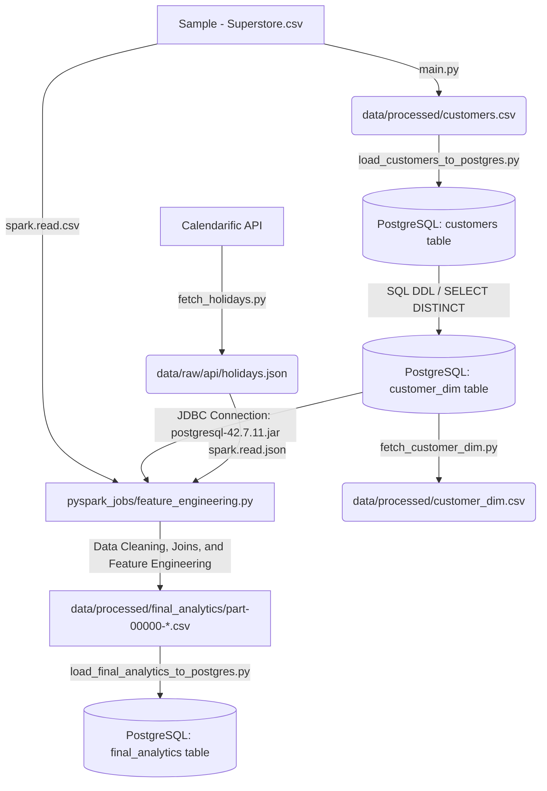

# Retail Holiday Sales Analytics Pipeline

An end-to-end data engineering pipeline designed to analyze the impact of key US holidays on retail sales. The pipeline ingests sales records from a raw dataset, fetches calendar events via a REST API, connects to a PostgreSQL database to query customer dimension data, and uses Apache PySpark to clean, join, and engineer features into a final analytics-ready dataset.

---

## Table of Contents
1. [Architecture & Data Flow](#architecture--data-flow)
2. [Prerequisites](#prerequisites)
3. [Project Directory Structure](#project-directory-structure)
4. [File Meanings & Rationale](#file-meanings--rationale)
5. [Step-by-Step Run Procedure](#step-by-step-run-procedure)
6. [Feature Engineering Details](#feature-engineering-details)
7. [Troubleshooting](#troubleshooting)

---

## Architecture & Data Flow

The pipeline integrates data from three distinct source systems:
1. **Raw CSV**: Flat-file transaction data containing retail orders, profits, and customer IDs.
2. **REST API**: Dynamically requested holiday calendars from the [Calendarific API](https://calendarific.com/).
3. **Relational Database (PostgreSQL)**: Customer master/dimension table queried via JDBC.

### Pipeline Diagram



---

## Prerequisites

Before running the project on your local machine, ensure you have the following prerequisites installed and configured:

### 1. Python 3.8+
Make sure Python is installed. You can check your version by running:
```bash
python --version
```

### 2. Java Development Kit (JDK 8 or JDK 11)
Apache Spark requires Java to run.
* Install Java JDK 8 or 11 (e.g., OpenJDK or Oracle JDK).
* Ensure the `JAVA_HOME` environment variable is set in your system environment variables pointing to your JDK installation path.
* Check installation by running:
  ```bash
  java -version
  ```

### 3. Apache Hadoop Winutils (For Windows Users)
Because Spark is built on Hadoop, Windows environments require the Hadoop native binaries (`winutils.exe` and `hadoop.dll`) to interact with the local file system without throwing exceptions.
* Create a folder named `C:\hadoop` and a subfolder `C:\hadoop\bin`.
* Download `winutils.exe` and `hadoop.dll` for Hadoop version **3.0.0** or **3.3.0** (e.g., from the trusted [cdarlint/winutils Github Repository](https://github.com/cdarlint/winutils)).
* Place both files inside `C:\hadoop\bin`.
* Set your system environment variable `HADOOP_HOME` to `C:\hadoop`, and add `C:\hadoop\bin` to your system `PATH`.
> [!NOTE]
> The final feature engineering job dynamically configures `HADOOP_HOME` inline, but having the physical files in `C:\hadoop\bin` is strictly required.

### 4. PostgreSQL Database
The project stores customer master data in PostgreSQL.
* Install PostgreSQL (v12 or higher).
* Ensure PostgreSQL service is running.
* Create a database named `retail_dw`:
  ```sql
  CREATE DATABASE retail_dw;
  ```

### 5. Calendarific API Key
The pipeline dynamically fetches US holiday metadata from Calendarific.
* Sign up for a free developer account at [Calendarific](https://calendarific.com/).
* Obtain your free API Key from the Calendarific dashboard.

---

## Project Directory Structure

```text
holiday_analytics_pipeline/
├── .env                              # Environment secrets configuration (database & API key)
├── .gitignore                        # Files and folders ignored by Git
├── README.md                         # Project documentation and run guide (this file)
├── main.py                           # Customer pre-processing extraction script (Pandas)
├── requirements.txt                  # Python dependencies
│
├── api/
│   └── fetch_holidays.py             # Script to ingest holiday data from REST API
│
├── config/
│   └── config.py                     # Configuration loader module for database credentials
│
├── dashboards/                       # Interactive visualization layers
│   ├── power_bi/                     # Power BI dashboard files and configuration
│   └── tableau/                      # Tableau dashboard files and configuration
│
├── data/
│   ├── raw/
│   │   ├── csv/
│   │   │   └── Sample - Superstore.csv  # Raw retail sales dataset
│   │   └── api/
│   │       └── holidays.json         # Downloaded holiday data from API
│   └── processed/
│       ├── customers.csv             # Unique customers extracted from raw CSV
│       ├── customer_dim.csv          # Exported customer dimension from PostgreSQL
│       └── final_analytics/          # Spark destination directory for integrated analytics data
│
├── docs/
│   └── screenshots/                  # (Placeholder) Reserved for documentation images
│
├── drivers/
│   └── postgresql-42.7.11.jar        # PostgreSQL JDBC driver JAR for Apache Spark
│
├── notebooks/                        # (Placeholder) Reserved for Jupyter notebooks
│
├── pyspark_jobs/                     # PySpark scripts for ETL & feature engineering
│   ├── test_spark.py                 # Spark environment diagnostic verification
│   ├── load_data.py                  # PySpark raw sales metadata loader
│   ├── prepare_holidays.py           # PySpark JSON holiday parser and flattener
│   ├── data_cleaning.py              # PySpark data type casting and validation utility
│   ├── data_integration.py           # Prototype join logic for Sales and Holidays
│   ├── load_customers_to_postgres.py # Loads customer CSV into PostgreSQL 'customers' table
│   ├── load_customers.py             # SQLAlchemy + Spark check on 'customers' table
│   ├── read_customers_from_postgres.py # JDBC reading from 'customers' table in Spark
│   ├── fetch_customer_dim.py         # Exports PostgreSQL 'customer_dim' to a CSV file
│   ├── load_final_analytics_to_postgres.py # Loads feature engineered CSV into PostgreSQL final_analytics table
│   └── feature_engineering.py        # The final pipeline executable joining CSV + JSON + JDBC
│
├── sql/
│   ├── create_tables.sql             # SQL schema/DDL definitions (database setup)
│   └── insert_customers.sql          # (Placeholder) Reserved for custom SQL insertions
│
└── tests/
    ├── test_api.py                   # (Placeholder) API testing suite
    └── test_pyspark.py               # (Placeholder) PySpark jobs testing suite
```

---

## File Meanings & Rationale

Here is the purpose and rationale behind each of the core files created in the project:

### 1. Root Configuration & Dependencies
* **[requirements.txt](file:///c:/Users/mishr/holiday_analytics_pipeline/requirements.txt)**: Contains the exact list of required Python libraries (e.g. `pyspark`, `pandas`, `sqlalchemy`, `psycopg2-binary` for database interactions, `requests` for API calls, and `python-dotenv` for local environment variable resolution).
* **[.env](file:///c:/Users/mishr/holiday_analytics_pipeline/.env)**: Houses external configuration secrets. It prevents API keys and database credentials from being committed to public repositories.
* **[config/config.py](file:///c:/Users/mishr/holiday_analytics_pipeline/config/config.py)**: Loads variables from `.env` using python-dotenv. This decouples credential loading from operational PySpark scripts, keeping database connection strings clean.

### 2. Pre-processing & API Ingestion
* **[main.py](file:///c:/Users/mishr/holiday_analytics_pipeline/main.py)**: Reads the raw CSV file using Pandas, extracts unique customer rows based on their metadata (Customer ID, Name, Segment, City, etc.), and writes them to a processed customer CSV file.
* **[api/fetch_holidays.py](file:///c:/Users/mishr/holiday_analytics_pipeline/api/fetch_holidays.py)**: Fetches holiday metadata from Calendarific's REST API for the years 2014–2017. It filters for sales-impacting holidays (like Thanksgiving, Christmas, Valentine's Day) and saves the raw response to `data/raw/api/holidays.json`.

### 3. Database Utility Scripts
* **[pyspark_jobs/load_customers_to_postgres.py](file:///c:/Users/mishr/holiday_analytics_pipeline/pyspark_jobs/load_customers_to_postgres.py)**: Establishes a connection to PostgreSQL using SQLAlchemy and writes the unique customer listings CSV directly into the `customers` table, replacing it if it already exists.
* **[pyspark_jobs/load_customers.py](file:///c:/Users/mishr/holiday_analytics_pipeline/pyspark_jobs/load_customers.py)**: Uses Pandas `read_sql` and SQLAlchemy to read the `customers` table and wraps it in a Spark DataFrame to inspect its contents.
* **[pyspark_jobs/read_customers_from_postgres.py](file:///c:/Users/mishr/holiday_analytics_pipeline/pyspark_jobs/read_customers_from_postgres.py)**: Connects to PostgreSQL directly inside Spark via JDBC format using the jar driver. This is standard practice in data engineering for processing database tables within PySpark.
* **[pyspark_jobs/fetch_customer_dim.py](file:///c:/Users/mishr/holiday_analytics_pipeline/pyspark_jobs/fetch_customer_dim.py)**: Extracts the relational customer dimension table (`customer_dim`) to `data/processed/customer_dim.csv` using Pandas.

### 4. Spark Processing & Final ETL
* **[drivers/postgresql-42.7.11.jar](file:///c:/Users/mishr/holiday_analytics_pipeline/drivers/postgresql-42.7.11.jar)**: The physical Java Archive database connector driver that allows Spark's JVM to communicate with PostgreSQL databases over JDBC.
* **[pyspark_jobs/test_spark.py](file:///c:/Users/mishr/holiday_analytics_pipeline/pyspark_jobs/test_spark.py)**: A diagnostic test script ensuring that local Apache Spark is configured and runs successfully.
* **[pyspark_jobs/load_data.py](file:///c:/Users/mishr/holiday_analytics_pipeline/pyspark_jobs/load_data.py)**: Loads raw superstore sales CSV into PySpark and displays the inferred schema.
* **[pyspark_jobs/prepare_holidays.py](file:///c:/Users/mishr/holiday_analytics_pipeline/pyspark_jobs/prepare_holidays.py)**: Evaluates the raw holidays JSON structure, extracting the arrays using PySpark's `explode` function to create a relational schema of dates, types, and holiday names.
* **[pyspark_jobs/data_cleaning.py](file:///c:/Users/mishr/holiday_analytics_pipeline/pyspark_jobs/data_cleaning.py)**: Validates raw data fields in the sales dataset by converting date strings to proper date formats, casting money and quantities to numeric formats, and logging missing or duplicate records.
* **[pyspark_jobs/data_integration.py](file:///c:/Users/mishr/holiday_analytics_pipeline/pyspark_jobs/data_integration.py)**: Integrates the cleaned Sales dataset with the Holidays dataset to analyze orders placed on specific holiday dates.
* **[pyspark_jobs/feature_engineering.py](file:///c:/Users/mishr/holiday_analytics_pipeline/pyspark_jobs/feature_engineering.py)**: **The final pipeline orchestrator**. It integrates Sales CSV, PostgreSQL JDBC customer dimensions (`customer_dim`), and Holidays API JSON. It performs multi-dataset joins, handles schema mappings, cleans data, engineers holiday features, and outputs a single clean dataset to `data/processed/final_analytics/`.
* **[pyspark_jobs/load_final_analytics_to_postgres.py](file:///c:/Users/mishr/holiday_analytics_pipeline/pyspark_jobs/load_final_analytics_to_postgres.py)**: Loads the final analytical dataset from the local filesystem (`data/processed/final_analytics/`) directly into the `final_analytics` table in the PostgreSQL database using Pandas and SQLAlchemy. It formats column names to lowercase snake_case and ensures date columns are loaded with correct datatypes.

---

## Step-by-Step Run Procedure

Follow this guide to run the pipeline end-to-end on your local system:

### Step 1: Set Up Project Environment
Open a terminal (e.g., PowerShell on Windows) in the project directory:

1. **Create Virtual Environment:**
   ```bash
   python -m venv venv
   ```
2. **Activate Environment:**
   * **Windows PowerShell:**
     ```powershell
     .\venv\Scripts\Activate.ps1
     ```
   * **Windows CMD:**
     ```cmd
     .\venv\Scripts\activate.bat
     ```
   * **Linux/macOS:**
     ```bash
     source venv/bin/activate
     ```
3. **Install Dependencies:**
   ```bash
   pip install -r requirements.txt
   ```

### Step 2: Configure Environment Secret Variables
Create a file named `.env` in the root folder of the project (`holiday_analytics_pipeline/`) and fill it out:
```ini
DB_HOST=localhost
DB_PORT=5432
DB_NAME=retail_dw
DB_USER=postgres
DB_PASSWORD=YOUR_POSTGRES_PASSWORD

CALENDARIFIC_API_KEY=YOUR_CALENDARIFIC_API_KEY
```

### Step 3: Initialize PostgreSQL Database & Tables
1. Connect to PostgreSQL and create the `retail_dw` database:
   ```sql
   CREATE DATABASE retail_dw;
   ```
2. Make sure you connect to `retail_dw` and execute the following DDL commands to create the customer dimension table (`customer_dim`):
   ```sql
   -- Create customer_dim table (dimension table)
   CREATE TABLE IF NOT EXISTS customer_dim (
       customer_id VARCHAR(50) PRIMARY KEY,
       customer_name VARCHAR(100),
       segment VARCHAR(50),
       city VARCHAR(100),
       state VARCHAR(100),
       region VARCHAR(50)
   );
   ```

### Step 4: Run Data Ingestion & SQL Population Scripts
Run the pipeline scripts in the following exact sequence:

1. **Ingest Holiday Data (API):**
   Calls the Calendarific API and populates `data/raw/api/holidays.json`.
   ```bash
   python api/fetch_holidays.py
   ```

2. **Extract Customers from Sales CSV:**
   Creates `data/processed/customers.csv`.
   ```bash
   python main.py
   ```

3. **Load Extracted Customers to PostgreSQL:**
   Automatically creates the `customers` table in the database and loads the CSV data.
   ```bash
   python pyspark_jobs/load_customers_to_postgres.py
   ```

4. **Populate Customer Dimension Table:**
   Run the following query in your PostgreSQL database to populate `customer_dim` with unique customer profiles:
   ```sql
   -- Run in PostgreSQL tool (e.g. pgAdmin, psql, or DBeaver) inside 'retail_dw' database
   INSERT INTO customer_dim (customer_id, customer_name, segment, city, state, region)
   SELECT DISTINCT ON (customer_id) customer_id, customer_name, segment, city, state, region
   FROM customers;
   ```
   *Note: This generates exactly 793 distinct records matching customer profiles.*

---

### Step 5: Run the Spark Analytics Pipeline
Run the main ETL Spark pipeline which joins the datasets, engineers analytics features, and saves the result:
```bash
python pyspark_jobs/feature_engineering.py
```

### Step 6: Load Final Analytics to PostgreSQL
Load the feature-engineered final CSV data into the PostgreSQL `final_analytics` table:
```bash
python pyspark_jobs/load_final_analytics_to_postgres.py
```
Result: Reads the generated CSV file, cleans and formats column names to lowercase snake_case, casts dates appropriately, and creates/replaces the `final_analytics` table in PostgreSQL.

### Step 7: Verify Outputs
Once the scripts complete successfully, check the following outputs:
* **Spark Final Output:** Look inside `data/processed/final_analytics/`. You should see a successful run indicated by a `_SUCCESS` file and a large `.csv` data partition file (containing the final merged, feature-engineered table).
* **PostgreSQL final_analytics Table:** Verify that the `final_analytics` table exists and is populated in your `retail_dw` database.
* **Exported PostgreSQL Check:** (Optional) Run the fetch script to download the database's dimension table into a local file:
  ```bash
  python pyspark_jobs/fetch_customer_dim.py
  ```
  This creates `data/processed/customer_dim.csv` on your filesystem.

---

## Feature Engineering Details

The feature engineering job (`pyspark_jobs/feature_engineering.py`) adds the following columns to help build machine learning models or run downstream sales reports:

| Column Name | Data Type | Description | Rationale / Source |
| :--- | :--- | :--- | :--- |
| `holiday_name` | String | Name of the holiday (e.g. Thanksgiving) | Injected from API calendar match |
| `holiday_flag` | Integer | `1` if the order was placed on a holiday, `0` otherwise | Identifies sales volume shifts during holidays |
| `month` | Integer | Month of the transaction (1-12) | Allows seasonal analysis |
| `year` | Integer | Year of the transaction (2014-2017) | Allows year-over-year growth comparisons |
| `quarter` | Integer | Quarter of the year (1-4) | Crucial for standard quarterly reporting cycles |
| `weekend_flag` | Integer | `1` if order date was Saturday or Sunday, `0` otherwise | Segments weekend shopping patterns |
| `profit_margin` | Double | `(Profit / Sales) * 100` rounded to 2 decimals | Direct measure of profit efficiency per order |

---

## Troubleshooting

### Issue 1: `java.io.IOException: Could not locate executable C:\hadoop\bin\winutils.exe`
* **Cause**: Missing Hadoop native binary dependencies on Windows.
* **Solution**: Download the Windows Hadoop support binaries `winutils.exe` and `hadoop.dll` for Hadoop 3.x and place them inside `C:\hadoop\bin\`. Ensure your environment variables `HADOOP_HOME` is set to `C:\hadoop`.

### Issue 2: `py4j.protocol.Py4JJavaError: An error occurred while calling oXX.load` or JDBC driver not found
* **Cause**: Spark cannot find the PostgreSQL JDBC driver JAR.
* **Solution**: Ensure that `drivers/postgresql-42.7.11.jar` is present in the repository root. Double-check that `feature_engineering.py` has the line:
  `config("spark.jars", "drivers/postgresql-42.7.11.jar")` properly uncommented and correctly referenced.

### Issue 3: Connection Refused in database connection
* **Cause**: PostgreSQL is not running or credentials in `.env` are incorrect.
* **Solution**: Start the PostgreSQL service, verify you created the `retail_dw` database, and double-check credentials in `.env`.
